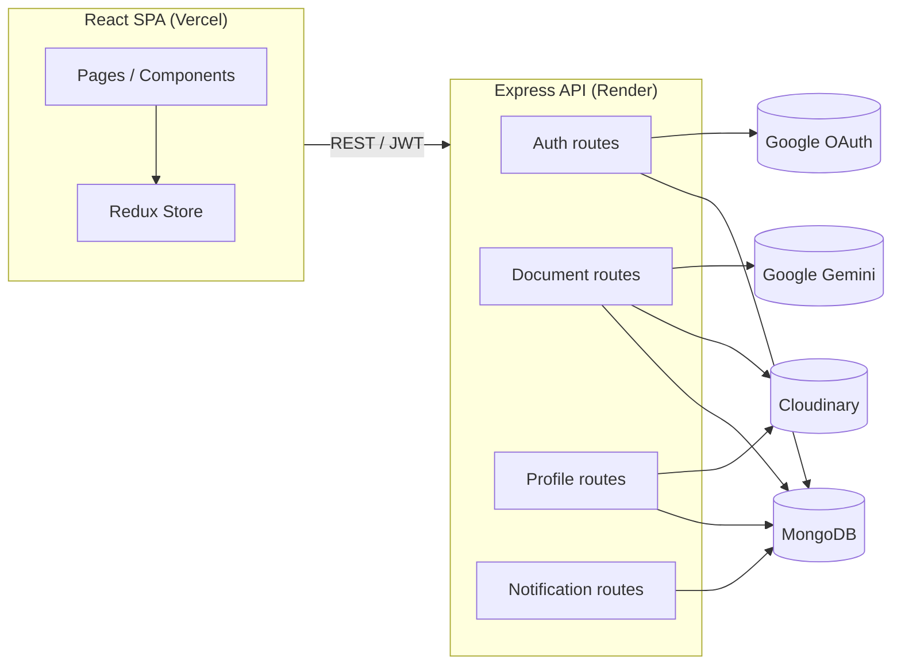

# Medocs

**A full-stack AI-powered health document management platform.**

Medocs lets users securely upload, organize, and understand their medical documents — with Google Gemini-powered summarization and Q&A, real-time notifications, and a polished, health-record-focused UI.


---

## Table of contents

- [Overview](#overview)
- [Features](#features)
- [Tech stack](#tech-stack)
- [Architecture](#architecture)
- [Getting started](#getting-started)
- [Environment variables](#environment-variables)
- [Project structure](#project-structure)
- [API overview](#api-overview)
- [Security](#security)
- [Known limitations / roadmap](#known-limitations--roadmap)

---

## Overview

Medocs is a single-page application built to solve a real, personal problem: keeping medical documents (lab reports, prescriptions, invoices, certificates) organized, searchable, and actually _understandable_ — without digging through a folder of scanned PDFs every time a doctor asks a question.

Live deployment: **frontend on Vercel**, **backend on Render**.

> _Add live demo link and screenshots here once finalized._

## Features

### Documents

- Upload with drag-and-drop, categorization (lab / prescription / invoice / certificate / misc), and description
- Paginated list with infinite scroll, month-grouped view, list/grid toggle
- Preview, download, edit, delete, and favorite/star documents
- AI-powered summarization and free-form Q&A per document (Google Gemini)

### Authentication & sessions

- Email/password and Google OAuth sign-in
- JWT access tokens with **refresh token rotation** (each refresh invalidates the previous token)
- Boot-time session verification — no false "still logged in" states from stale local tokens
- Robust SPA back-button handling across login/logout/OAuth redirects

### Profile & health records

- Personal information, health information (allergies, chronic conditions, medications, past surgeries), and emergency contact — each independently editable
- Avatar upload via Cloudinary
- Real storage usage stats (document count, size used, AI analyses run)

### Notifications

- Real backend-driven notifications, triggered by actual events (document upload, AI analysis completion)
- Per-category notification preferences (on/off, persisted per user)
- Unread indicator in the sidebar

### Settings

- Theme switching (dark / light / system), persisted and applied instantly
- Notification preferences
- Data export (JSON snapshot of profile, documents, AI analyses, and notification history)
- Account deletion with cascading cleanup (documents, Cloudinary assets, analyses, notifications, profile, refresh tokens)

### Security & robustness

- Rate limiting on auth routes (IP-based) and AI routes (per-user)
- MongoDB injection protection (`express-mongo-sanitize`)
- Concurrent-refresh guard on the frontend (prevents duplicate `/auth/refresh` races)
- Scoped, `httpOnly`, `sameSite=none` refresh-token cookies

## Tech stack

**Frontend:** React (Vite), Redux Toolkit, React Router (data router, persistent layout via `<Outlet />`), Axios

**Backend:** Node.js, Express, MongoDB (Mongoose), Passport (Google OAuth), JWT

**AI:** Google Gemini (document summarization, Q&A)

**Storage:** Cloudinary (documents + avatars)

**Deployment:** Vercel (frontend), Render (backend)

## Architecture



## Getting started

### Prerequisites

- Node.js 18+
- A MongoDB instance (local or Atlas)
- A Cloudinary account
- A Google Cloud OAuth client (for Google sign-in)
- A Google Gemini API key

### Backend

```powershell
cd server
npm install
```

Create `config.env` in `server/` (see [Environment variables](#environment-variables)), then:

```powershell
npm start
```

### Frontend

```powershell
cd medocs-frontend
npm install
```

Create `.env` in `medocs-frontend/` with `VITE_API_URL` pointing at your backend, then:

```powershell
npm run dev
```

## Environment variables

**Backend (`server/config.env`)**

| Variable                                                                 | Description                                        |
| ------------------------------------------------------------------------ | -------------------------------------------------- |
| `PORT`                                                                   | Server port (defaults to 8000)                     |
| `MONGODB_URL`                                                            | MongoDB connection string                          |
| `API_SECRET`                                                             | JWT signing secret                                 |
| `CLIENT_URL`                                                             | Frontend origin, for CORS and OAuth redirects      |
| `CLIENT_ID` / `CLIENT_SECRET`                                            | Google OAuth credentials                           |
| `GEMINI_API_KEY` / `GEMINI_MODEL`                                        | Google Gemini API credentials and model name       |
| `CLOUDINARY_CLOUD_NAME` / `CLOUDINARY_API_KEY` / `CLOUDINARY_API_SECRET` | Cloudinary credentials                             |
| `MAX_UPLOAD_SIZE_BYTES`                                                  | Optional, defaults to 10 MB per file               |
| `NODE_ENV`                                                               | `production` in deployment, enables secure cookies |

**Frontend (`medocs-frontend/.env`)**

| Variable       | Description                                            |
| -------------- | ------------------------------------------------------ |
| `VITE_API_URL` | Backend base URL (e.g. `http://localhost:8000` in dev) |

## Project structure

```
server/
  router/         # Express route definitions (auth, dashBoard, profile, notifications)
  models/         # Mongoose schemas
  middleware/     # authMiddleware, rate limiters
  controllers/    # OAuth callback handling
  services/       # Gemini + Cloudinary integration
  config/         # Passport strategy setup

medocs-frontend/
  src/
    routes/       # Page-level route components (app/, auth/)
    components/   # Reusable UI (documents/, ui/, layout/)
    hooks/        # useDocumentActions, useProfileActions, useTheme, etc.
    store/        # Redux slices (doc, profile, modal, auth)
    services/     # API call wrappers per resource
    api/          # Axios instance, interceptors, URI config
    data/         # Static config (categories, edit-section field configs)
    utility/      # Shared helper functions
```

## API overview

| Base path        | Covers                                                         |
| ---------------- | -------------------------------------------------------------- |
| `/auth`          | Signup, login, refresh (rotating), Google OAuth, session check |
| `/dashboard`     | Document CRUD, upload, AI analyze/ask                          |
| `/profile`       | Profile CRUD, avatar upload, data export, account deletion     |
| `/notifications` | List, unread count, mark read / mark all read                  |

All protected routes require a Bearer JWT and run through `authMiddleware`.

## Security

- **Rate limiting** — IP-based on auth endpoints, per-user on AI endpoints (protects against brute-force and runaway AI cost)
- **Refresh token rotation** — every `/auth/refresh` call issues a new token and revokes the old one; reuse of a revoked token is detected and rejected
- **Input sanitization** — `express-mongo-sanitize` strips operator-injection attempts from request bodies/queries
- **Cookie scoping** — refresh tokens are `httpOnly`, scoped to `/auth/refresh`, and use `sameSite=none; secure` for the cross-origin Vercel/Render deployment

## Known limitations / roadmap

Being upfront about what's genuinely unfinished, rather than leaving it undocumented:

- **AI Assistant chat page** — UI exists, backend wiring not yet complete
- **Structured health-metric extraction / trend charts** — planned, not started
- **AI model selection in Settings** — UI stub, not wired to a real setting
- **Two-factor authentication / active device list** — UI stub, no backend
- **Apple sign-in** — UI stub, no OAuth provider configured
- **Automated tests** — not yet in place
- **Storage cap** — the "1 GB" display is a nominal UI convention, not an enforced quota
- **Notification unread count** — checked once on app load, not live/real-time
- **Data export** — includes metadata and document links (not a zipped bundle of the actual files)
